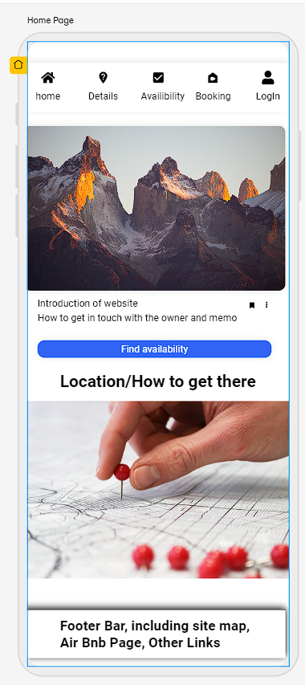
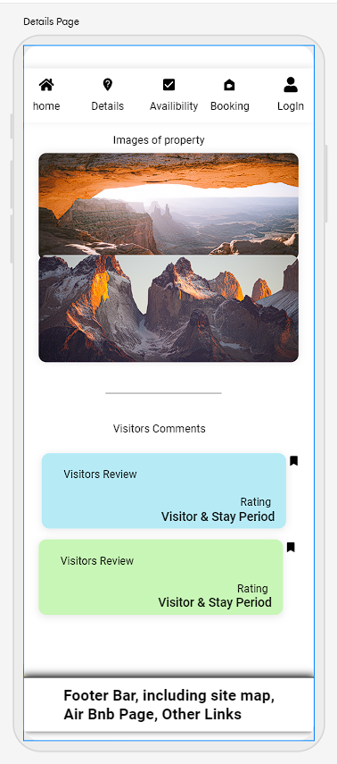
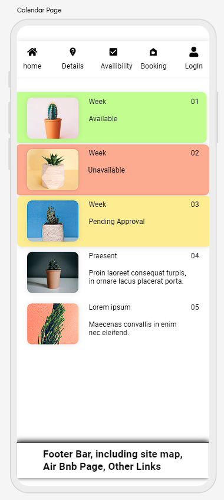
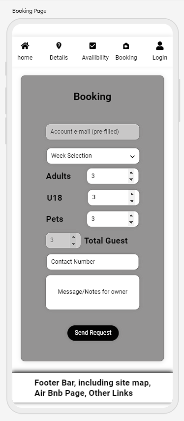
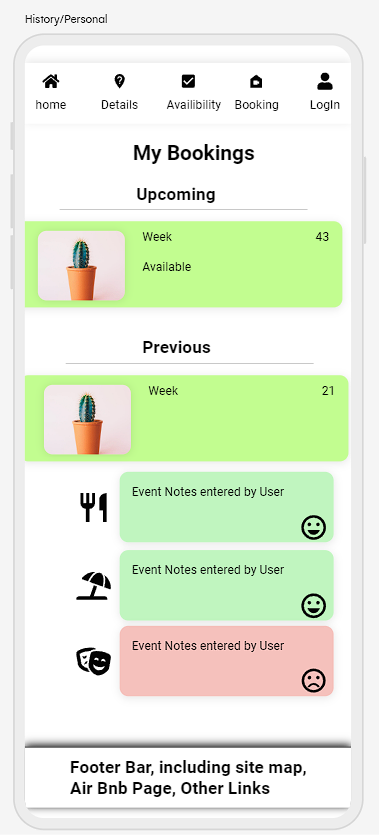

# Index

1. [Introduction](#introduction)
    * [deployed website](#deployed)
    * [Github Repo](#github)
1. [Breakdown/Approach](#approach)
1. [Requirements](#requirements)
1. [User Stories](#user-stories)
1. [Design](#design)
    * [Template Layout](#template-layout)
        * [Mobile](#mobile-first)
    * [Data Table(s)](#data-tables)
1. [Testing](#testing)
    * [Test Driven Development](#test-driven-development-tdd)
    * [Behaviour Driven Development](#behaviour-driven-development-bdd)
1. [Bugs and Fixes](#bugs)
    * [Bugs to be fixed](#bugs-to-be-fixed)
    * [Bugs fixed](#bugs-fixed)
1. [Dev Log](#dev-log)
    * [Deployment](#deployment)
    * [Creating a copy](#creating-a-copy)
    * [Progression log](#progression-log)
1. [Acknowledgements](#acknowledgements)
1. [References](#references)
    * [Languages, Libraries and Frameworks used](#languages-libraries-and-frameworks-used)
    * [Code sources](#code-sources)
    * [Information/Influence](#informationinfluence)

## Introduction

Link to repository site - https://github.com/FluffyBullet/BensRental
Link to live website - https://bensrental.herokuapp.com

Owners of Caravans, Chalet's, Holiday homes hire their accommodations to others whilst not in use to provide extra income, contributing to the upkeep cost of their property. In this instance, my friend Ben Kennedy owns a Caravan in Isle of Wight, United Kingdom advertising over [Air BnB](#air-bnb) and [DirectHolidayHomes](#directholidayhomes) but continuously checking between sites on bookings and making notes for task to be completed, i.e request for payment, send welcome package e-mail.

As part of my 5 course, level 5 Diploma degree with CodeInstitute, I intend to use my fourth project as an example of a solution for owners and hiring systems and holiday makers. 
My aim is for users to view at ease a calendar with days and their status, either booked and not available, Requested by others and not available, or Free for request. Then forwarding onto a different page for a booking request.

Owners of the holiday home will have the ability to accept or refuse the requested holidays, also store notes for admin use only regarding users.
Users will have the ability to check availability of weeks available, History of visits, adding general feedback to be displayed on the main page and personal notes on previous visits i.e specific stores, attractions.

****

## Approach

Looking at the project scope, users expect a simple and easy to use interface to:

1. Find information (Location, Availability)

1. Make a Booking or Cancellation

1. Log in to find account information.

To get a good understanding of the flow of information, I will first look over multiple websites offering overnight stay, alternative days and rental of accommodation.

Also conduct a Q&A Session with the owner of mentioned caravan to ensure my envisaged and expected information overlaps or includes all relevant information. This session is also used to expand my selection of information for what may be helpful at a later stage.

****

## Requirements

For the website to display information to all users without manually editing an availability panel on the main website - this will need use of a Database, automatically updating.

The caravan owner will need a record of information to advise who is hiring the caravan and how to make contact with them. To log this, the above mentioned Database will include a table of information from the user, but retrieved from the hirer's profile.

For a hirer to request for rental period of the caravan, the website will need to host the ability to create profiles, which include name, address, contact details.

The user of the site will also have the ability to logging their own personal notes and overall rating comments for their recently visited trip. Another table will be made on the above database allowing comments for everyone to see with a rating, then also a personal comment section for trips and visits.

A display of images of the caravan available for hire, to showcase the accommodation's features space and expectation.

Creating of a To-Do list for the owner of the caravan with pre-made alerts based of hirer's start date to request money, send site information and end date to arrange cleaner, add ability to comment on their stay and more.

An authorisation algorithm to avoid end users from creating duplicate accounts and double booking the caravan with a confirmed or in query stay.

****

## User Stories

### For Users:

As a User, I:
1. Want to see what days are available to be booked
1. What the caravan looks like, Internally and Externally
1. Contact the owner with queries regarding the Caravan/my booking
1. Create an Account to book holiday's
1. Book a stay via the website
1. See the Weather forecast for a day/week (API with weather site, added as a condition - may need to be added at a later date)
1. View my historic visits/bookings and personal notes for the trips.
1. Have quick access to links where the accommodation may be advertised
1. Wish to update my details stored on my profile

### For Owners:

As an owner, I:
1. Wish to view contact details of accounts who have booked my caravan.
1. Approve or Remove post from general comments
1. Add personal notes to holiday makers accounts for myself or other owners
1. Book out my accommodation for holiday's made via other websites
1. Create a "todo" list which include the following task:
    * Send response email with dates and bank details, with T&C's
    * Check for deposit payment and forward receipt
    * Update spreadsheet with booking and other websites
    * Advise Cleaner of new holiday dates and upcoming requirements
    * Chase for balance of payment 6 weeks before start date
    * Remind Cleaner closer to time of booking
    * Forward combination lock code 1 day before start date
    * Return security deposit with thank you message
    * Follow up with e-mail requesting feedback

****
## Design

For an overview and comparison of websites available, I visit a host of sites offering bookings and holiday's alike for understanding of layout etc.
also linked below in [References](#references), websites I used to study their design and create my idea's are as follows:

1. [momondo](https://www.momondo.co.uk/packages)
1. [Airbnb](https://www.airbnb.co.uk)
1. [Booking.com](https://booking-dp.lastminute.com/?token=TKvXM_jtvLchrJlmj0DdgwMIW0HZzYtISeyNMfc47YQxNjczOTA4NDkz&aid=304142)
1. [Tui](https://www.tui.co.uk/destinations/deals)

All above listed websites and others found have similar displays with icon images of offers and selection dates for bookings at the top for filtering. However, as my site is focusing on the individual rental of a caravan, I will be looking at a feature rather than variety. For this, I took further inspiration from [Accuweather in my local area with a monthly display](https://www.accuweather.com/en/gb/nuneaton/cv11-4/january-weather/331362). When reducing the screen to mobile sizing, I found although the website removes the advertisement column the dates are still squashed, making me re-design the display in smaller displays.

For this, I chose to display as a "pill" capsule with week reference rather than the 30 day calendar. 

****
### Template Layout

#### Mobile First

As a mobile first approach, I have created wireframes using website [www.app.uizard.io](https://app.uizard.io) for small displays. On completion of the app, I will later revise suitability for medium (Tablet) and large (Monitor) screens.

| Page | Details | Visual Display |
|---|---|---|
| Home Page |To include information of the property owner and location/map of site | |
| Details Page |To include images of caravan and reviews by users | |
| Calendar Page |Colour feedback for available weeks with brief details| |
| Booking Page |Form with pre-generated text and enabling users to edit further requirements. | |
| Holidays Page |Page for users to view confirmed holiday's and upcoming, with their comments on events visited. | |

### Data Tables

To Complete all task required of the website and linking Accounts, Bookings, ToDo task, Images and comments/reviews - I have opted to use a relational approach with the following tables/information:

**User**
| field | Data Type | Key | Required? |
|---|---|---|---:|
| _reference | Integer | Primary | Automatic |
| account_name | String | Foreign Key| Yes |
| first_name | String | N/A | Yes |
| last_name | String | N/A | Yes |
| contact_number |  Integer | N/A | Yes |
| address_line1 | String | N/A | Yes |
| address_line2 | String | N/A | Yes |
| address_line3 | String | N/A | No |
| address_line4 | String | N/A | No |
| post_code | String | N/A | Yes |
| email_address | String | N/A | Yes |
| pref_of_contact | String | N/A | Yes |
| admin_comment | String | N/A | No |

**Comment**
| field | Data Type | Key | Required? |
|---|---|---|---:|
| reference | Integer | Primary | Automatic |
| account_name | String | Foreign Key | Automatic |
| booking_reference | Integer | Foreign Key | Automatic |
| overall | String | N/A | No |
| overall_feeling | Interger | N/A | No |
| personal | String | N/A | No |
| personal_feeling | Integer | N/A | No |
| display | Boolean | N/A | No (Admin Only) | 

**Booking**
| field | Data Type | Key | Required? |
|---|---|---|---:|
| account_name | String | Foreign Key | Automatic |
| booking_reference | Integer | Primary Key | Automatic |
| start_date | date | Foreign Key | Yes |
| end_date | date | Foreign Key | Yes |
| number_of_guest | Integer | N/A | Automatic |
| number_of_o18 | Integer | N/A | Yes |
| number_of_u18 | Integer | N/A | Yes |
| number_of_pets | Integer | N/A | Yes |

**Task**
| field | Data Type | Key | Required? |
|---|---|---|---:|
| task_ref | Integer | Primary Key | Automatic |
| user_name | String | Foreign Key | Yes |
| booking_reference | Integer | Foreign Key | Yes |
| start_date | date | Foreign Key | No |
| end_date | date | Foreign Key | No |
| task_description | String | N/A | Yes |
| complete | Boolean | N/A | Yes |

**Messages**
| field | Data Type | Key | Required? |
|---|---|---|---:|
| _thread | Integer | Primary Key | Automatic |
| _from | Integer | Foreign Key | Automatic |
| _to | Integer | Foreign Key | Yes |   
| _header | String | N/A | Yes | 
| _body | String | N/A | Yes |
| report | Boolean | N/A | Yes | 

****
## Testing
### Test Driven Development (TDD)
### Behaviour Driven Development (BDD)

Throughout the development course, I have selected Behaviour Driven Development to ensure each function works the expected values.
including:

Anchor tags to open links on new tab:
1. testing with:
    1. footer links, airbnb and directholidayhomes
        1. both links open into a new tab as expected
    1. Home page links, owner details (e-mail), Wight link website and Red Funnel
        1. Under owner details, the link ben@kennedy.com uses the default mail provider to send an e-mail to the address provided.
        1. "Getting there", Wight Link opens the website page on a new tab of the browser.
        1. "Getting there", Red Funnel opens the website page on a new tab of the browser.
    1. "Getting there", Google maps insert:
        1. "View larger map" - clicking on link opens a new tab in the selected browser.
        1. Zoom Icons - Both zoom in and out work at Browser level.

Rotation of images on details page:
1. "Caravan Images" totals 15 images, but for better display to the user the page is set up with a single image and arrows to move to next and previous.
    1. Make sure the link does not break on images to be displayed:
        1. Pressing forward arrow 15+ times after loading page
            1. Pressed the forward arrow 19 times - the images successfully loop through themselves without error or not displaying images.
        1. Pressing back arrow 15+ times after loading page
            1. Pressed the back arrow 16 times, the images succesfully loop through themselves without error or not displaying images.
        1. Both above have also been tested in mobile mode with "iPhone SE" as the selected browser - also works as expected

Bookings page: 
1. Display of availability
    1. As not logged in, the website should display information to show what weeks are available or taken.
        1. links show as available with green background, option to book and the charge for the week below.
    1. As a user/requester of the page, the website should display similar to the not-logged-in, but with my bookings I should be able to update the information or cancel
        1. Login: fluffy, password: Password321
        1. Currently, 1 week and 4 are available showing as green.
        1. Week 2 is boooked by another user - showing text of "Sorry, this week is not available"
        1. Week 10 is booked under the fluffy account - links at the bottom for Update and Cancel booking.
    1. As an admin, I expect to see similar to a user/requester, but on weeks booked I can see who requested this booking. Then choices below to update or cancel the booking 
        1. Login: ben, password: kennedy
    1. All above links display as expected.
1. Amending my booking
    1. As a user/requester,I would like to amend my booking:
        1. Updating my previous entries.
            1. When selecting the "update" icon on the availability form, the user is forward onto a page which allows them to change their previous entries. The form is pre-populated from their last submission.
            1. When selecting the "cancel booking" you are taken to another page headed as "cancel booking". This page is for secure click to ensure the user did not cancel by mistake.. Completing the cancel booking process, the user is taken back to the availability page with an alert to say "sorry you cancelled your booking, hope to see you soon".
            1. All test above work as expected.
1. Booking
    1. As not logged in, the page is to display a request of the user to log in to view this page.
        1. This works as expected.
        1. Clicking on the login or signup page links to the correct sites - imported from django-allauth 
    1. As a user/requester and admin, I expect a form requesting for details, with entry fields available for entry.
        1. form validation to be added.
        1. completion of request then pressing submit request re-directs the user to the availability page and displays an alert to advise the booking has been registered.
    1. Booking a week already selected
        1. If selecting a week already booked, on submit request, an error is displayed to advise this week has already been chosen, please chose another.

1. Making a comment
    1. When a user is logged in (provided by allauth), they are directed to "my visits" page, which is alos accessible by hovering over the user icon. This page displays tables per visit booked from the user, with option to select  for a public comment and personal comment.
    1. Public Comment - 
        1. This comment is to be displayed on the "details" page after the user saves their comment. 
        1. Clicking on the "click here to add one!" forwards the user onto adding a comment page, with overall rating too.
        1. Typing in the users text then clicking "add comment" button, the comment is saved to the database and displayed on the details page, also the top section of the visit.
    1. Personal comment - 
        1. Similar with personal notes, clicking on "add a new comment here" the user will be transfered on the same page. Saving of this comment will display in the bottom section.
    1. Editing comments - 
        1. Under each comment made by the user for the posting, two icons will be available for the user to select. Edit and Delete.
        1. Clicking on edit transfers the user to the similar page as creating a comment but with updated headers.
        1. Upon editing the comment, the user is transfered back to "my visits" page with an alert to confirm the update has been processed.
    1. Deleting comments - 
        1. The delete icon is displayed as a bin icon, at the bottom right of the comment text. Clicking on this opens a modal seeking confirmation for deletion.
        1. After confirming the deletion, the comment is removed from the stay view and database.
    1. All above test have been made and work as noted.

1. Creating new bookings (admin)
    1. As an admin, the owner needs to add new dates for selection to their holiday home. To complete this, when logged in as an admin a panel will display at the top of the page.
    1. The admin/staff can enter the year for creation in a number field then "create" button. This will create weeks for the year selected (53 weeks).
    1. The above test have been made and work as noted.


****
## Bugs

### Bugs to be Fixed

nav bar icons are mis-aligned as they have dropdown icons and further information. This also displays incorrectly when a user is logged out. 

### Bugs Fixed

Bug found when viewing website on herokuapp link, but showing no styling and images. This was caused by "MIME" type not recognising text/css as a type and following the walkthrough for my example - the website was looking for the requested images on cloudinary static instead of root directory.
Following a mention on stack overflow, I found a setting to import to setting.py

```
import mimetypes
mimetypes.add_type("text/css",".css",True)
```

details.html page started with a library of photo's to be displayed, but with sizing and formatting - I chose to use similar to my previous project in JavaScript. Having an active tile and looping through whilst changing their style tags.
1. corrected by the below, javascript could not function without being initialized.

However, creating this - console is advising $.fn.foundation is not selectable - issue with the CSS Framework and I believe attempting to use jQuery. This is to be reviewed at a later date.
1. fixed by initializing foundation at the bottom of index page using custom script tag and loading the document.

****
## Dev Log

23/1/23


Whilst viewing the data and building my database and profile on Visual Studio code I found the codes followed a scattered path with fields either not covered or with errors. To correct this, I have stripped back the commits and re-worked on the previous repository with details on models.py. 

Also recognising creation of "Accounts" model overlaps user automatically imported by Django Allauth.

26/1/23

For setting up the website and using a responsive first layout, I have selected CSS Framework "Foundation" with the provided CND Link off their website. This is linked into the base.html file, applying to all pages for the website's page(s).

Setting up the home page, I connected to the booking table with a queryset, but had no interaction with the database. After searches across multiple sites and conversations, 


### Deployment
### Creating a copy

For a copy of this project, you can select "Fork" on the top right of the [project repository](https://github.com/FluffyBullet/BensRental). On the dropdown displayed after clicking the button, the bottom will show "+ Create a new fork"

This will create a repository in your own github, but will require the following to be displayed as a website:

1. Create a env.py file in your IDE to include the following variables:
    1. Database URL - provided by your database provider, in example on this course I used ElephantSQL
    1. Secret Key - This can be a secure string/pattern chosen by yourself or a random generated password.
1. Add a new pipeline on Heroku, then configuring your "VARS" in the settings tab to include the above, along with PORT and value of 8000.


### Progression log

After creating two templates and base template, I used w3 validators for HTML and CSS written on this project.

index.html included queries advising:
1. consider using lang tag in html
    *  as this is imported form base.html with django, this comment is not valid
1. include head tag
    * as this is imported form base.html with django, this comment is not valid
1. bad value - src tag seen with use of {, advising as a illegal character in path segment
    * as this is imported form base.html with django, this comment is not valid
1. img tag with no alt attribute
    * On creation this was first entered with aria-label, but is now corrected
1. iframe has issues with scrolling, frameborder, marginheight, marginwidth and style
    * This code is imported from a webiste which is tested and provided the information required.

details.html was also tested, displaying similar results. However, the W3 Validator has corrected my inclusion of closing tag in the image. These are now removed.
****
## Acknowledgements

Jason Reynolds - Trouble shooting conversations to approach bugs and errors

****
## References

Fix found from Stack Overflow for MIME issue - https://stackoverflow.com/questions/22839278/python-built-in-server-not-loading-css
Checking code is compatible with PEP8 - https://www.tutorialspoint.com/online_python_formatter.htm

### Languages, Libraries and Frameworks used

With use of the database interactivity and passing information between back end and front end, my fourth project will be using Python's 'Django' framework, accompanied with frameworks such as:
1. Psycopg2
1. Gunicorn
1. dj_database_url

For creating the template's of the websites, I'm using "Foundation" framework. Their website: https://get.foundation/sites/docs/installation.html, also adding my own requirements of CSS which can be found in the static folder and CSS File.

My Templates will be created by the use of HTML5

I will also require formatting of injected HTML, to achieve this I will be using JavaScript and jQuery.


### Code Sources

Embedding of google maps - https://www.embedgooglemap.net/

W3 Schools - 

setting up home url without link to views or database functions
- https://www.w3schools.com/django/django_add_main.php


creating dropdown link for navigation bar
- https://www.w3schools.com/howto/howto_css_dropdown_navbar.asp


django documentation -

- https://docs.djangoproject.com/
for information on views, url paths and model help.


****
### Information/Influence
#### [DirectHolidayHomes](https://www.directholidayhomes.co.uk/isle-of-wight/whitecliff_bay/9261)
#### [Air-BnB](https://www.airbnb.co.uk/rooms/724593970566123396?check_out=2023-04-23&children=1&adults=2&check_in=2023-04-21&s=13&unique_share_id=1C6B345E-5664-4BFC-978B-D44F176DF9F1&_branch_match_id=1143999629027938480&_branch_referrer=H4sIAAAAAAAAA8soKSkottLXT0zKS9LLTdV3NXZNSi1McnUrTwIASr96TxsAAAA%3D&source_impression_id=p3_1673988994_LFGiA3pz8ETWP8Ky)