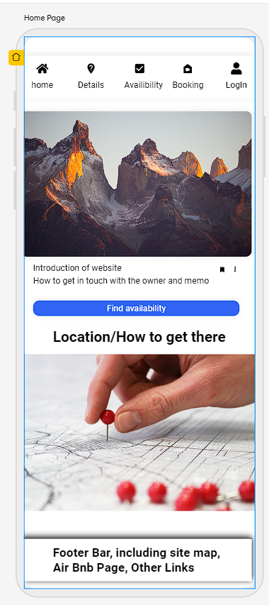
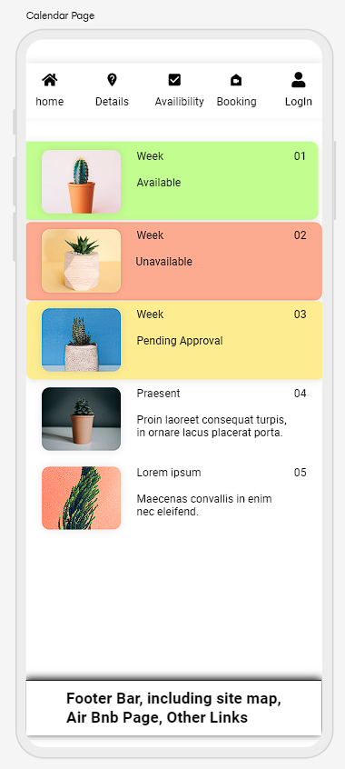
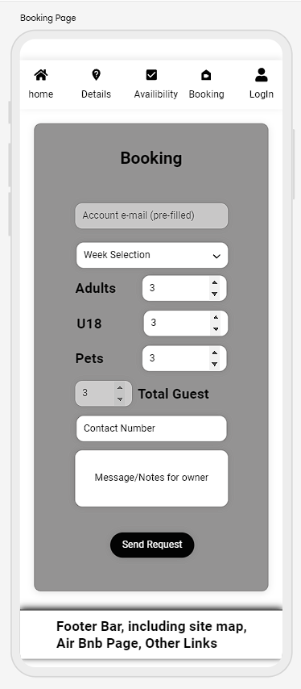
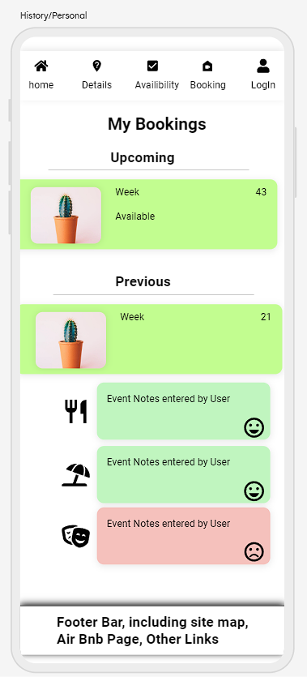

# Index

1. [Introduction](#introduction)
    * [deployed website](#deployed)
    * [Github Repo](#github)
1. [Breakdown/Approach](#approach)
1. [Requirements](#requirements)
1. [User Stories](#user-stories)
1. [Design](#design)
    * [Template Layout](#template-layout)
        * [Mobile](#mobile-first)
    * [Data Table(s)](#data-tables)
1. [Testing](#testing)
    * [Test Driven Development](#test-driven-development-tdd)
    * [Behaviour Driven Development](#behaviour-driven-development-bdd)
1. [Bugs and Fixes](#bugs)
    * [Bugs to be fixed](#bugs-to-be-fixed)
    * [Bugs fixed](#bugs-fixed)
1. [Dev Log](#dev-log)
    * [Deployment](#deployment)
    * [Creating a copy](#creating-a-copy)
    * [Progression log](#progression-log)
1. [Acknowledgements](#acknowledgements)
1. [References](#references)
    * [Languages, Libriaries and Frameworks used](#languages-libraries-and-frameworks-used)
    * [Code sources](#code-sources)
    * [Information/Influence](#informationinfluence)

## Introduction

Owners of Caravans, Chalet's, Holiday homes hire their accomodations to others whilst not in use to provide extra income, contributing to the upkeep cost of their property. In this instance, my friend Ben Kennedy owns a Caravan in Isle of Wight, United Kingdom advertising over [Air BnB](#air-bnb) and [DirectHolidayHomes](#directholidayhomes) but continuously checking between sites on bookings and making notes for task to be completed, i.e request for payment, send welcome package e-mail.

As part of my 5 course, level 5 Diploma degree with CodeInstitute, I intend to use my fourth project as an example of a solution for owners and hiring systems and holiday makers. 
My aim is for users to view at ease a calendar with days and their status, either booked and not available, Requested by others and not available, or Free for request. Then forwarding onto a different page for a booking request.

Owners of the holiday home will have the ability to accept or refuse the requested holidays, also store notes for admin use only regarding users.
Users will have the ability to check availability of weeks available, History of visits, adding general feedback to be displayed on the main page and personal notes on previous visits i.e specific stores, attractions.

****

## Approach

Looking at the project scope, users expect a simple and easy to use interface to:

1. Find information (Location, Availability)

1. Make a Booking or Cancellation

1. Log in to find account information.

To get a good understanding of the flow of information, I will first look over multiple websites offering overnight stay, alternative days and rental of accomodation.

Also conduct a Q&A Session with the owner of mentioned caravan to ensure my envisaged and expected information overlaps or includes all relevant information. This session is also used to expand my selection of informaton for what may be helpful at a later stage.

****

## Requirements

For the website to display information to all users without manually editing an availability panel on the main website - this will need use of a Database, automatically updating.

The caravan owner will need a record of information to advise who is hiring the caravan and how to make contact with them. To log this, the above mentioned Database will include a table of information from the user, but retrived from the hirer's profile.

For a hirer to request for rental period of the caravan, the website will need to host the ability to create profiles, which include name, address, contact details.

The user of the site will also have the ability to logging their own personal notes and overal rating comments for their recently visited trip. Another table will be made on the above database allowing comments for everyone to see with a rating, then also a personal comment section for trips and visits.

A display of images of the caravan available for hire, to showcase the accomodation's features space and expectation.

Creating of a To-Do list for the owner of the caravan with pre-made alerts based of hirer's start date to request money, send site information and end date to arrange cleaner, add ability to comment on their stay and more.

An authorisation algorithm to avoid end users from creating duplicate accounts and double booking the caravan with a confirmed or in query stay.

****

## User Stories

### For Users:

As a User, I:
1. Want to see what days are avaialble to be booked
1. What the caravan looks like, Internally and Externally
1. Contact the owner with queries regarding the Caravan/my booking
1. Create an Account to book holiday's
1. Book a stay via the website
1. See the Weather forecast for a day/week (API with weather site, added as a condition - may need to be added at a later date)
1. View my historic visits/bookings and personal notes for the trips.
1. Have quick access to links where the accomodation may be advertised
1. Wish to update my details stored on my profile

### For Owners:

As an owner, I:
1. Wish to view contact details of accounts who have booked my caravan.
1. Approve or Remove post from general comments
1. Add personal notes to holiday makers accounts for myself or other owners
1. Book out my accomodation for holiday's made via other websites
1. Create a "todo" list which include the following taks:
    * Send response email with dates and bank details, with T&C's
    * Check for deposit payment and forward receipt
    * Update spreadsheet with booking and other websites
    * Advise Cleaner of new holiday dates and upcoming requirements
    * Chase for balance of payment 6 weeks before start date
    * Remind Cleaner closer to time of booking
    * Forward combination lock code 1 day before start date
    * Return security deposit with thank you message
    * Follow up with e-mail requesting feedback

****
## Design

For an overview and comparison of websites avaialble, I visit a host of sites offering bookings and holiday's alike for understanding of layout etc.
also linked below in [References](#references), websites I used to study their design and create my idea's are as follows:

1. [momondo](https://www.momondo.co.uk/packages)
1. [Airbnb](https://www.airbnb.co.uk)
1. [Booking.com](https://booking-dp.lastminute.com/?token=TKvXM_jtvLchrJlmj0DdgwMIW0HZzYtISeyNMfc47YQxNjczOTA4NDkz&aid=304142)
1. [Tui](https://www.tui.co.uk/destinations/deals)

All above listed websites and others found have similar displays with icon images of offers and selection dates for bookings at the top for filtering. However, as my site is focusing on the individual rental of a caravan, I will be looking at a feature rather than variety. For this, I took furhter inspiration from [Accuweather in my local area with a monthly display](https://www.accuweather.com/en/gb/nuneaton/cv11-4/january-weather/331362). When reducing the screen to mobile sizing, I found although the website removes the advertisement column the dates are still squashed, making me re-design the display in smaller displays.

For this, I chose to display as a "pill" capsule with week reference rather than the 30 day calendar. 

****
### Template Layout

#### Mobile First

As a mobile first approach, I have created wireframes using website [www.app.uizard.io](https://app.uizard.io) for small displays. On completion of the app, I will later revise suitability for medium (Tablet) and large (Monitor) screens.

| Page | Details | Visual Display |
|---|---|---|
| Home Page |To include information of the property owner and location/map of site | |
| Details Page |To include images of caravan and reviews by users | |
| Calendar Page |Colour feedback for available weeks with brief details| |
| Booking Page |Form with pre-generated text and enabling users to edit further requirements. | |
| Holidays Page |Page for users to view confirmed holiday's and upcoming, with their comments on events visited. | |

### Data Tables

To Complete all task required of the website and linking Accounts, Bookings, ToDo task, Images and comments/reviews - I have opted to use a relational approach with the following tables/information:

**User**
| field | Data Type | Key | Required? |
|---|---|---|---:|
| _reference | Integer | Primary | Automatic |
| account_name | String | Foreign Key| Yes |
| first_name | String | N/A | Yes |
| last_name | String | N/A | Yes |
| contact_number |  Integer | N/A | Yes |
| address_line1 | String | N/A | Yes |
| address_line2 | String | N/A | Yes |
| address_line3 | String | N/A | No |
| address_line4 | String | N/A | No |
| post_code | String | N/A | Yes |
| email_address | String | N/A | Yes |
| pref_of_contact | String | N/A | Yes |
| admin_comment | String | N/A | No |

**Comment**
| field | Data Type | Key | Required? |
|---|---|---|---:|
| reference | Integer | Primary | Automatic |
| account_name | String | Foreign Key | Automatic |
| booking_reference | Integer | Foreign Key | Automatic |
| overall | String | N/A | No |
| overall_feeling | Interger | N/A | No |
| personal | String | N/A | No |
| personal_feeling | Integer | N/A | No |
| display | Boolean | N/A | No (Admin Only) | 

**Booking**
| field | Data Type | Key | Required? |
|---|---|---|---:|
| account_name | String | Foreign Key | Automatic |
| booking_reference | Integer | Primary Key | Automatic |
| start_date | date | Foreign Key | Yes |
| end_date | date | Foreign Key | Yes |
| number_of_guest | Integer | N/A | Automatic |
| number_of_o18 | Integer | N/A | Yes |
| number_of_u18 | Integer | N/A | Yes |
| number_of_pets | Integer | N/A | Yes |

**Task**
| field | Data Type | Key | Required? |
|---|---|---|---:|
| task_ref | Integer | Primary Key | Automatic |
| user_name | String | Foreign Key | Yes |
| booking_reference | Integer | Foreign Key | Yes |
| start_date | date | Foreign Key | No |
| end_date | date | Foreign Key | No |
| task_description | String | N/A | Yes |
| complete | Boolean | N/A | Yes |

**Messages**
| field | Data Type | Key | Required? |
|---|---|---|---:|
| _thread | Integer | Primary Key | Automatic |
| _from | Integer | Foreign Key | Automatic |
| _to | Integer | Foreign Key | Yes |   
| _header | String | N/A | Yes | 
| _body | String | N/A | Yes |
| report | Boolean | N/A | Yes | 

****
## Testing
### Test Driven Development (TDD)
### Behaviour Driven Development (BDD)
****
## Bugs
### Bugs to be Fixed
### Bugs Fixed
****
## Dev Log

23/1/23

Whilst viewing the data and building my database and profile on Visual Studio code I found the codes followed a scattered path with fields either not covered or with errors. To correct this, I have stripped back the commits and re-worked on the previous repository with details on models.py. 

Also recognising creation of "Accounts" model overlaps user automatically imported by Django Allauth.

26/1/23

For setting up the website and using a responsive first layout, I have selected CSS Framework "Foundation" with the provided CND Link off their website. This is linked into the base.html file, applying to all pages for the website's page(s).

Setting up the home page, I connected to the booking table with a querset, but had no interaction with the database. After searches across mutliple sites and conversations, 

### Deployment
### Creating a copy
### Progression log
****
## Acknowledgements

Jason Reynolds - Trouble shooting conversations to approach bugs and errors

****
## References

### Languages, Libraries and Frameworks used

For creating the template's of the wesites, I'm using "Foundation" framework. Their website: https://get.foundation/sites/docs/installation.html

### Code Sources

Embedding of google maps - https://www.embedgooglemap.net/

W3 Schools - 

setting up home url without link to views or database functions
- https://www.w3schools.com/django/django_add_main.php

****
### Information/Influence
#### [DirectHolidayHomes](https://www.directholidayhomes.co.uk/isle-of-wight/whitecliff_bay/9261)
#### [Air-BnB](https://www.airbnb.co.uk/rooms/724593970566123396?check_out=2023-04-23&children=1&adults=2&check_in=2023-04-21&s=13&unique_share_id=1C6B345E-5664-4BFC-978B-D44F176DF9F1&_branch_match_id=1143999629027938480&_branch_referrer=H4sIAAAAAAAAA8soKSkottLXT0zKS9LLTdV3NXZNSi1McnUrTwIASr96TxsAAAA%3D&source_impression_id=p3_1673988994_LFGiA3pz8ETWP8Ky)